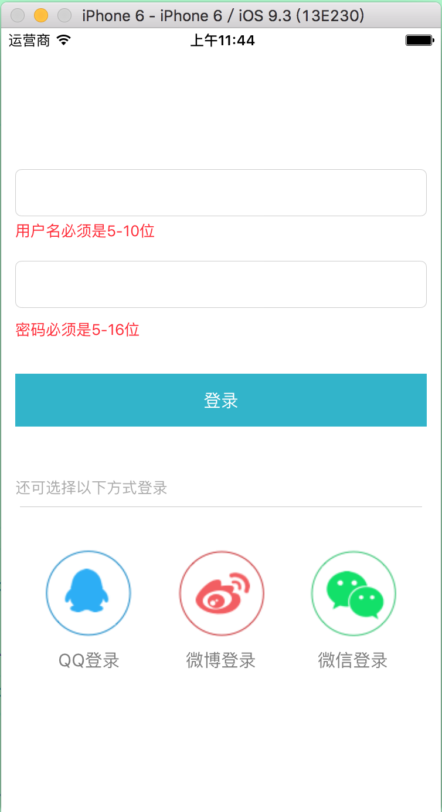

# RXSwiftDemo
RXSwift登陆及第三方登陆 MMVV框架 以及Alamofire请求部分的封装

####这个demo也是我业余时间试着学习，希望也能帮助其他和我一样在努力奋斗的coder

####网络层
	     enum Result<T>  {
	    case Success(T)
	    case Failure(ErrorType)
	    }
	//enum IaskuErrorType :ErrorType { case NoNetwork,NoData, ParsingError }//发现 还是下面那个FailureType好用
	enum FailureType:ErrorType {
	    case Failed(message: String,code:Int)
	    
	    var message : String{
	        if case  .Failed(let m, _) = self{
	            return m
	        }else{
	            return ""
	        }
	    }
	}
使用	
	
           Alamofire.request(.GET, kWeiboAPIUsersUrl, parameters: [kWeiboAPIkeyUid:userID,kWeiboAPIkeyAccess_Token:accessToken]).responseJSON().map({ (result) -> Result<UserConvertible> in
            //本来想把解析封装进去的 原谅我出现了一小点点问题，我无法解决的问题
            //extension Observable where Element : Result<JSON>  对Observable<Observable>进行extension怎么实现
                switch result{
                case Result.Success(let json) :
                    let userDetail = SinaUserDetail(json: json)
                     WKConfigCenter.shareCenter.userDetail = userDetail
                    return Result.Success(userDetail)
                case  Result.Failure(let errorType):
                    return Result.Failure(errorType)
                    
                    
                }

           })

####解析层
	//单个对象解析
	protocol ObjectJSONConvertType {
	    static func getSelf(json:JSON) throws -> ObjectJSONConvertType
	}
	//list解析成数组<object>
	protocol ListJSONConvertType {
	    static func getSelfList(json:JSON) throws -> [ListJSONConvertType]
	}
	比如用户因为用户有三种第三方登陆来源 所以我用户是个协议
	protocol UserConvertible{

    
    var userNmae :String { get }
    
    var id :String { get }
    
    var avatar_hd:String{get}
    
    
}

	class SinaUserDetail :UserConvertible,ObjectJSONConvertType{
	var userNmae: String = ""
    var id :String = ""
    var avatar_hd:String = ""
     init(json:JSON){
    print(json.count)
       userNmae = json["name"].string ?? "微博小朋友"
        id = "weibo" + (json["id"].string ?? "")
        avatar_hd = json["avatar_hd"].string ?? ""
    }
	static func getSelf(json:JSON) throws -> ObjectJSONConvertType{
	        let obj = SinaUserDetail(json:json)
	        return obj
	    }
	}
	
	
####具体MMVV  我这个模式我在RAC里面的规范类似 把事件的绑定处理都写进VM 
	
	
	
	